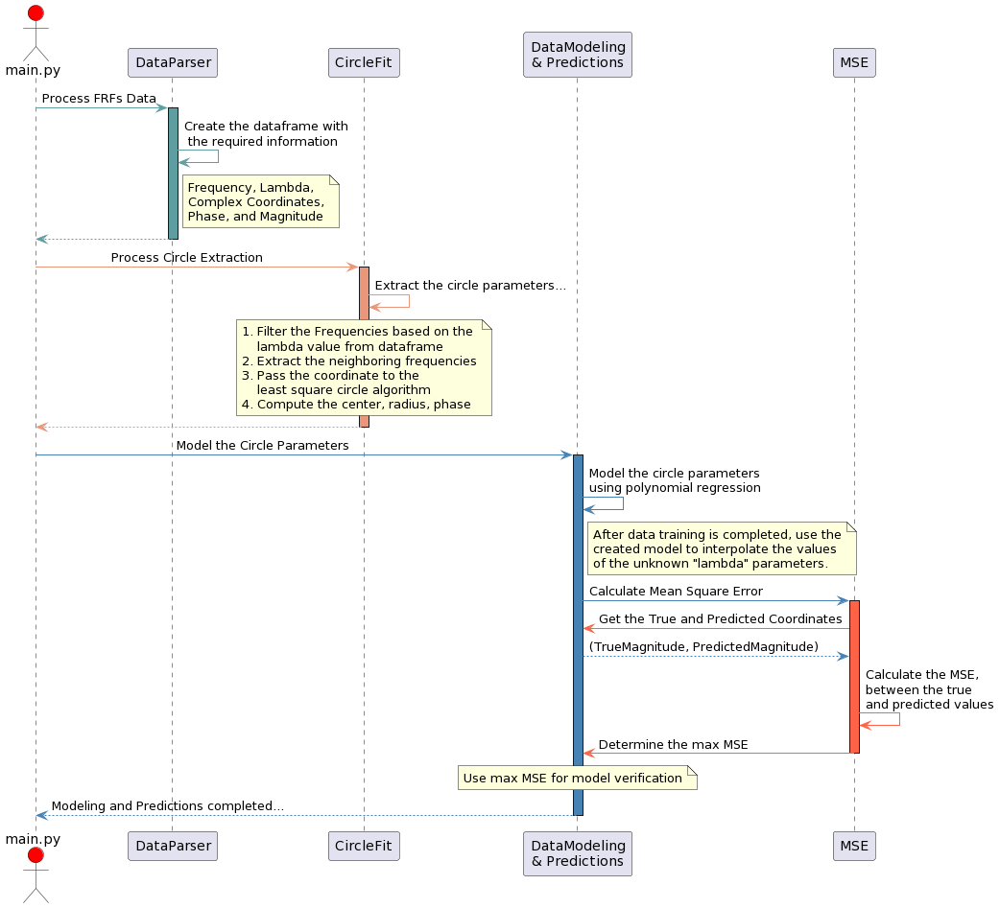

# Master's Thesis Project

- To run the predictions goto 'src/' folder and run py main.py
- Run `--help` to see the main.py usage.
  

## Abstract
Surrogate modeling, or meta-modeling, is a powerful technique to approximate complex simulation data efficiently. It replaces more complex and computationally expensive models that predict or simulate the behavior of the actual system. Due to its ability to provide accurate predictions with reduced computational costs, it has become the de facto choice in various science and engineering disciplines. For example, in electromagnetic systems, surrogate models are the most suitable alternative to reduce the simulation time and facilitate the behavior of the actual system. Often electromagnetic systems exhibit complex-valued behavior, it is difficult to model such systems using real-valued data, and most of the existing surrogate modeling approaches are confined to scalar data. Henceforth there is a need to develop surrogates that can accurately handle and predict complex-valued simulation data. 

This thesis research proposes a novel approach to model the complex-valued Frequency Domain (FD) simulation data to cater to this need. First, the data from the numerical simulation is used to fit the complex-valued S-parameters of the frequency dependent data into circles. The extracted circle parameters, which are smoother curves, are then used for further modeling and building the surrogates using the Polynomial Regression Method (PRM). Finally, these models are used to interpolate the data of unknown values of the FD simulation data. The Mean Square Error (MSE) between the actual and predicted curves is used as a benchmark to evaluate the performance of the models. In addition, this thesis research comprises the study and practical implementation of various circle fit techniques and an adaptive scheme to tune the number of adjacent frequency neighbors used for circle fit.

## Sequence Diagram (Overview)

